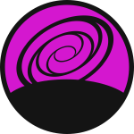

<!-- markdownlint-disable MD041 -->

    <h1>
        
         
        BreachedSpeak
		 
		
		
		
		
		
    </h1>

> [!CAUTION] Early and Active Development
> It is currently not recommended to use this library for any production level projects
>
> If you choose to ignore this warning notice, then you do so at your own risk!

BreachedSpeak is a small C++ library created to improve the developer experience and speed up the development of
TeamSpeak 3 Client plugins.

To achieve its goal the library intends to add many features such as improved logging, a UI Framework, and more.

## 📝 Table of Contents <!-- omit in toc -->

- [Contributing](#contributing)
- [Contributors](#contributors)
- [License](#license)

## Building and Installing

See the [BUILDING](docs/BUILDING.md) document.

## Contributing

Due to this projects early state of development we are currently not accepting external contributions.

## Contributors

- [@skyeBreach](https://www.github.com/skyeBreach)

## License

© 2024, [Skye Benson](https://github.com/skyeBreach). All Rights Reserved.

See [LICENSE](LICENSE) for more information on the license that this repository uses.
